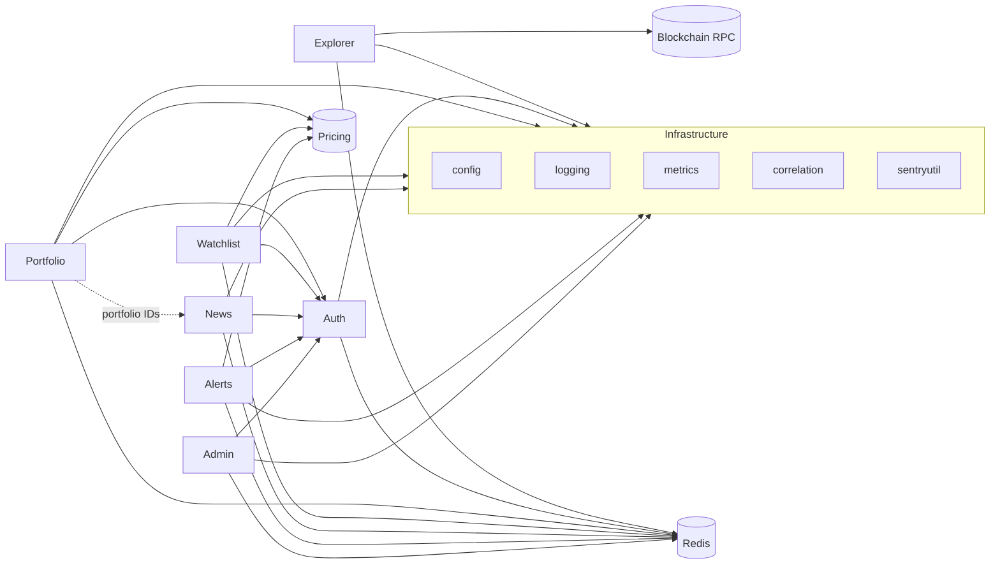

# Bounded contexts

This document defines the **domains** (bounded contexts) of the Bitcoin Explorer backend as implemented today, their **dependencies**, and **rules** for new code so we avoid cross-domain leaks. Application wiring and HTTP handlers live in **`internal/server`**; the **`cmd/server`** binary is a thin entrypoint.

It satisfies [ROADMAP_TO_100.md](../ROADMAP_TO_100.md) task **1** and should be updated when a major feature moves into its own package or when dependencies change.

---

## Context map (summary)

| Context | Responsibility | Primary data / integration |
|--------|----------------|----------------------------|
| **Auth** | Sessions, CSRF, users, roles (`user` / `admin`), password policy | Redis (`session:*`, user hashes), in-memory fallbacks |
| **Explorer** | Block/tx/address search, cached RPC reads, HTML/API search | Bitcoin RPC (GetBlock etc.), Redis cache keys (`block:*`, `tx:*`, …) |
| **Portfolio** | CRUD, valuation, exports (CSV/PDF/JSON) | Redis `portfolio:{user}:{id}`, pricing (`internal/pricing`) |
| **Watchlist** | CRUD, entries, quotas | Redis `watchlist:{user}:{id}`, pricing for display links |
| **News** | Symbol news, portfolio-scoped news, provider + cache | `internal/news`, Redis cache keys from `news.Service`, TheNewsAPI (config) |
| **Alerts** | Price alerts CRUD, background evaluation, in-app notifications | Redis alerts + notifications, pricing, email (`internal/email`) |
| **Admin** | Status, cache control, operational views | Redis `INFO`/`KEYS`, rate-limit introspection, metrics |

**Cross-cutting** (not separate business domains, but every handler touches them): **`internal/logging`**, **`internal/metrics`**, **`internal/correlation`**, **`internal/sentryutil`**, **`internal/config`**, **`internal/redisstore`** (sessions), rate limiting middleware.

---

## Dependency rules (allowed direction)

Dependencies should flow **inward** toward core value or **sideways** only through explicit shared contracts. In this repo, **composition happens in `internal/server` (`Run`)**; `internal/*` packages must not import each other in a cycle.

**Reading the diagram**

- **Explorer** talks to the chain and generic cache; it does **not** depend on portfolio/watchlist.
- **Portfolio** and **Watchlist** assume an **authenticated user** (Auth) and use **pricing** for fiat/valuation.
- **News (portfolio route)** needs **Auth** + a valid **portfolio ID** for that user (logical dependency on portfolio ownership, enforced in handlers).
- **Alerts** combine **Auth**, **pricing** (threshold evaluation), **notifications**, and optional **email**.
- **Admin** sits on **Auth** + **Redis** (and observability); it must not embed portfolio business rules beyond RBAC.

---

## Package placement today

| Area | Where it lives | Note |
|------|----------------|------|
| News provider + cache | `internal/news` | Good bounded module; keep provider-specific code here. |
| Pricing | `internal/pricing` | Shared by portfolio, watchlist, alerts, dashboard. |
| Email | `internal/email` | Used by alerts/notifications flows; do not embed HTTP handler logic here. |
| Blockchain RPC | `internal/blockchain` | Explorer-only concerns; portfolio does not import it for valuation. |
| Sessions / CSRF | `internal/server` + `internal/redisstore` | Candidate to extract behind interfaces later. |

Most **handler logic** still lives in **`internal/server`**, split across several `*.go` files by area (same package). **Domain service interfaces** (`ExplorerService`, `AuthService`, `PortfolioService`, etc.—see `internal/server/service_interfaces.go`) sit in front of Redis/RPC for testability; defaults delegate to existing helpers. When extracting further, keep **one context per package** (e.g. `internal/portfolio`) and **inject** Redis, pricing, and auth checks—do not let portfolio import watchlist or vice versa.

---

## Anti-patterns (“cross-domain leaks”)

1. **Reaching into another context’s Redis keys** from unrelated code (e.g. watchlist handler reading `portfolio:*` without going through portfolio rules).
2. **Shared mutable globals** for new features—prefer passing dependencies into constructors (see [ROADMAP_TO_100.md](../ROADMAP_TO_100.md) tasks 4–8).
3. **Duplicating business rules** (e.g. portfolio ownership checks) in news or admin handlers—centralize validation or use a small shared helper in the owning context only.
4. **Import cycles** between future `internal/portfolio` and `internal/watchlist`—extract shared DTOs to `internal/apiutil` or a thin `internal/domain` only if strictly value-only types.

---

## Maintenance

- **When adding an endpoint:** name which context it belongs to in the PR description.
- **When adding a Redis key prefix:** document it in the owning context section of this file or in code next to the constant.
- **Review checklist:** “Could this live in a different service?” If yes, keep boundaries explicit in code comments at the call site.
